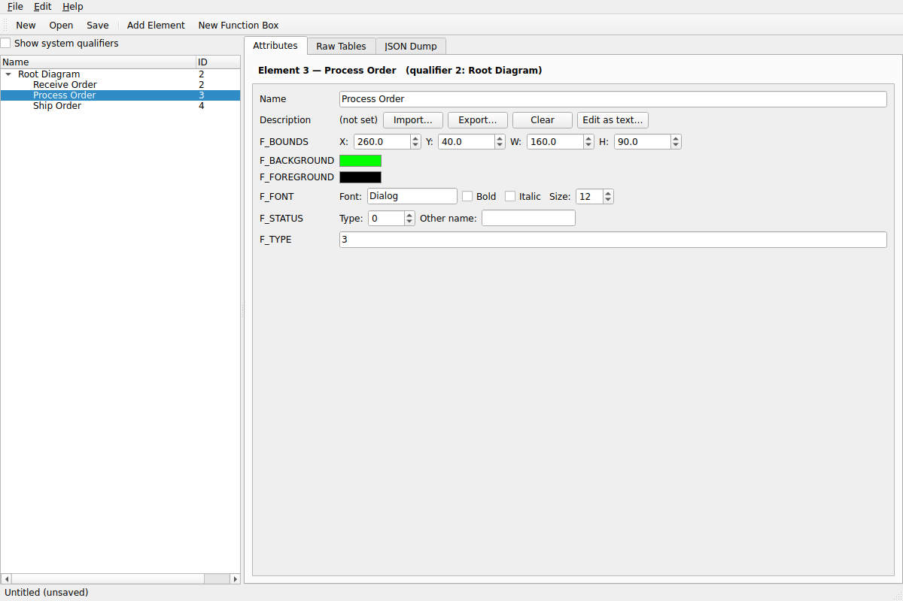

# Ramus RSF Editor

A native Linux desktop application (PyQt6) for reading and editing
[Ramus](https://github.com/Vitaliy-Yakovchuk/ramus) IDEF0/DFD model files
(`.rsf`) — built on a clean-room, from-scratch reimplementation of the file
format. See [`RAMUS_RSF_FORMAT.md`](RAMUS_RSF_FORMAT.md) for the full
reverse-engineering write-up (what's confirmed against real sample files vs.
inferred from source, and known limitations).



Not affiliated with the Ramus project. `.rsf` is a ZIP of self-describing
XML tables (see the format doc) — this tool reads and writes that container
directly; it does not require Ramus or a JVM to be installed.

## What's in the box

- **`ramus-rsf-gui`** — the GUI: browse every qualifier/element in a model
  tree, edit any attribute with a type-appropriate widget (text, numbers,
  color pickers, font/bounds/status editors, file/HTML-text attachments),
  a generic raw-table spreadsheet editor for anything not specifically
  modeled (including IDEF0 arrow/sector tables), a live JSON dump viewer/
  exporter, and dialogs for creating new elements, new IDEF0 function
  boxes, and new diagrams cloned from an existing template qualifier.
- **`ramus-rsf-cli`** — a scriptable command-line inspector (`dump`,
  `qualifiers`, `elements`, `show`, `tables`, `table`, `rename`).
- **`ramus_rsf_tool`** — the underlying Python library
  (`rsf_core`/`rsf_model`/`template`), usable on its own for scripting;
  see the examples in `RAMUS_RSF_FORMAT.md` section 13.

## Features

- Open, edit, and save `.rsf` files losslessly (byte-identical round trip
  for anything untouched — GUI session state, attachments, print settings).
- Create a brand-new model from scratch (`File > New`) with no template
  file required.
- Full attribute editing for the standard IDEF0 function-box set: Name,
  Description (rich text/HTML), bounds, background/foreground color,
  font, status, type.
- Generic editors for every other attribute type in the format (Text,
  Long, Double, Date, Currency, Boolean, Icon, file attachments, element
  links, hierarchical trees, arrow/sector tables, formulas, ...) — nothing
  in the file is unreachable, even attribute types with no dedicated
  widget, via the Raw Tables tab.
- Structural edits: add/delete/rename elements, add new qualifiers, add
  IDEF0 function boxes with full visual attributes in one dialog, clone an
  existing diagram's attribute set to start a new one, register a new
  diagram as a top-level model root.
- JSON export of the whole model (or just user-visible qualifiers) for
  scripting, review, or feeding to other tools.

## Installing on Arch Linux

### Option A: makepkg (recommended)

```sh
cd packaging
makepkg -si
```

This builds and installs `ramus-rsf-tool-git`, including the desktop
launcher, icon, and `.rsf` MIME association, using `python-pyqt6` from the
official Arch repos. After installing, launch **Ramus RSF Editor** from
your application menu, or run:

```sh
ramus-rsf-gui [FILE.rsf]
ramus-rsf-cli --help
```

### Option B: pip (any Linux, incl. Arch without makepkg)

```sh
sudo pacman -S python-pyqt6   # or: pip install --user PyQt6
python3 -m venv .venv && source .venv/bin/activate
pip install .
ramus-rsf-gui
```

For development (editable install + tests):

```sh
pip install -e ".[dev]"
pytest
```

## Running without installing

```sh
pip install --user PyQt6
python3 -m ramus_rsf_tool.gui.app [FILE.rsf]      # GUI
python3 -m ramus_rsf_tool.rsf_cli qualifiers FILE.rsf   # CLI
```

## Project layout

```
ramus_rsf_tool/
  rsf_core.py      container layer: ZIP + generic self-describing XML tables
  rsf_model.py      semantic EAV layer: qualifiers/elements/attributes,
                     TYPE_MAP, IDEF0 function-box convenience helpers
  rsf_cli.py        command-line inspector (also the `ramus-rsf-cli` entry point)
  template.py       builds a minimal valid archive from scratch (File > New)
  gui/
    app.py            GUI entry point (`ramus-rsf-gui`)
    main_window.py     menus, toolbar, panel wiring, file I/O, dirty tracking
    widgets/
      qualifier_tree.py    left-hand qualifier/element navigator
      attribute_editor.py  per-attribute editors (the "Attributes" tab)
      field_widgets.py     generic per-SQL-type widget builders
      raw_table_view.py    generic spreadsheet editor (the "Raw Tables" tab)
      json_dump.py         JSON dump viewer/exporter tab
      dialogs.py           New Element / New Function Box / Clone Qualifier / ...
      common.py            ColorButton and small shared helpers
tests/                pytest suite (format round-trips, model edits, GUI smoke tests)
packaging/            PKGBUILD, .desktop launcher, MIME type, icon reference
RAMUS_RSF_FORMAT.md   the file-format reverse-engineering write-up
```

## Testing

```sh
pip install -e ".[dev]"
QT_QPA_PLATFORM=offscreen pytest tests/ -v
```

The GUI tests run against Qt's `offscreen` platform plugin, so the full
suite (format round-trips, model editing, and GUI interaction) runs
headless in CI or over SSH with no X server required. `QT_QPA_PLATFORM`
isn't needed when a real display is available.

## Known limitations

Inherited from the underlying format reverse-engineering (see
`RAMUS_RSF_FORMAT.md` for details):

- **Drawing a brand-new IDEF0 arrow from scratch is not supported.**
  Existing arrow/sector data (`IDEF0.Sector`/`SectorBorder`/`SectorPoint`)
  can be viewed and edited via the Raw Tables tab, but the crosspoint/
  ordinate allocation needed to safely synthesize a *new* arrow wasn't
  fully recovered from static analysis (section 10).
  - **Linking a function box to its own child decomposition diagram** is
    not exposed; only registering a *new top-level model root* is
    (section 9).
- Nothing here has been confirmed by opening output files in the real
  Ramus GUI (no JVM/Gradle toolchain was available while building this) —
  correctness was instead verified by exhaustive round-trip and edit
  testing against real sample `.rsf` files and the reverse-engineered
  encoding rules. See `RAMUS_RSF_FORMAT.md` section 14 for exactly what
  was and wasn't verified.

## License

MIT — see [`LICENSE`](LICENSE). This is an independent, clean-room
implementation of the file format; it does not reuse or link against
Ramus's (GPL-3.0) source, though the format write-up documents what was
learned by reading it.
